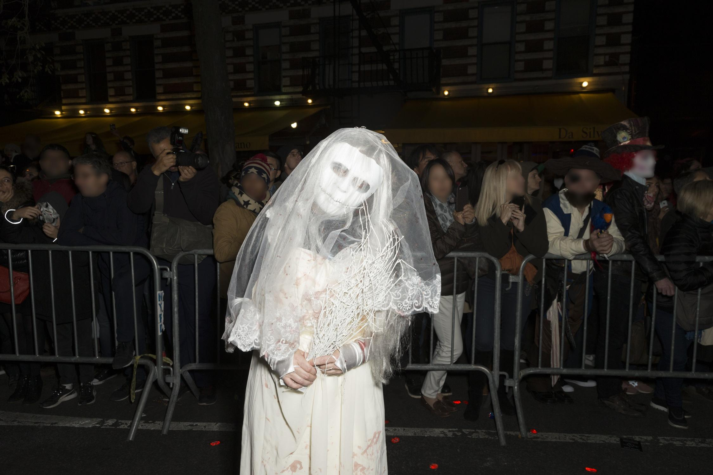
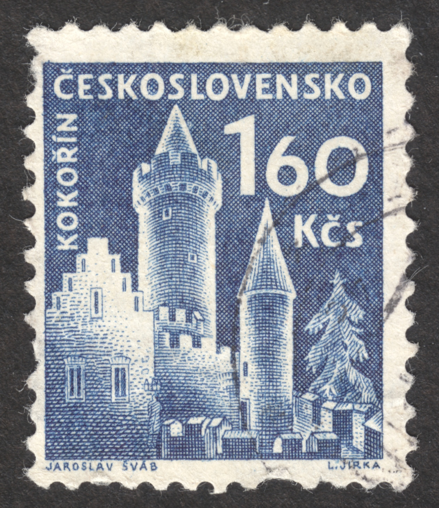

# Huge VQA Dataset Tool

This repository contains a tool for generating a huge visual question-answering (VQA) dataset. It does so by
using GPT-4V(ision) to automatically generate question-answer pairs for given images. This allows the tool
to generate a dataset larger than existing datasets, which all require some level of crowdsourcing.
Includes:
- Tool to go from downloaded images -> JSON with question-answer pairs for each question
- Visualization tool to create human-readable results
- Demo/starter dataset containing Q/A pairs for a subset of Segment Anything

## Installation and Setup

### Installation
1. Clone this repository.
2. In your chosen environment, install dependencies using `requirements.txt`.

### OpenAI Setup
In order to use the tool, you must have the OpenAI API set up. You can set up your account [here](https://openai.com/blog/openai-api).

**IMPORTANT**: Set up your API key following [the instructions here at Step 2](https://platform.openai.com/docs/quickstart?context=python).

## Usage
Use these commands from the root folder of the repository to run the tool.

1. Generate question batches from a root image folder

```python scripts/generate_batches.py --image_folder images --batch_size 80```

This will output question batches as json files in export/question_batches

2. Run a question batch

```python scripts/run_batch.py --batch_fpath export/question_batches/batch_2_of_3.json --output_fpath export/answer_batches/batch_2_of_3.json --prompt_fpath prompts/current.txt --debug_dir export/debug```

This will output parsed GPT Q/A pairs in export/answer_batches/batch_2_of_3.json

3. Consolidate batch outputs into one file

```python scripts/consolidate_answers.py --answers_dir export/answer_batches --output_fpath export/answers.json```

4. Visualize Q/A pairs

```python visualization/app.py``` - can add -i argument to override the default path to your Q/A pair JSON.

## Image Dataset
We have decided to use the [Segment Anything dataset](https://segment-anything.com/dataset/index.html)
created by Meta AI. For prompt engineering, testing, and evaluation we chose 110 images, which
can be found [here](./image_subset). The 10 pictures in the prompt engineering folder were
ones that we found to be interesting or challenging for models to perceive.

Our demo/starter dataset can be found at [this google drive](https://drive.google.com/file/d/118Hy0UY2c6GmBxvmxz9BbA5HeS8k9wnL/view?usp=sharing).

*In order to use the results from the dataset you will need to download the first 2 tar files [here](https://scontent-iad3-2.xx.fbcdn.net/m1/v/t6/An8MNcSV8eixKBYJ2kyw6sfPh-J9U4tH2BV7uPzibNa0pu4uHi6fyXdlbADVO4nfvsWpTwR8B0usCARHTz33cBQNrC0kWZsD1MbBWjw.txt?ccb=10-5&oh=00_AfDnBt9Rekikl1latWWVAvKIVv8JbNoXcY__FqIcWaYbTQ&oe=65A314D8&_nc_sid=0fdd51).

The generic tool we build will be able to take in any folder of image files to generate
Q/A pairs.

## Examples

| Question | Answer |
| -------- | ------ |
|What is the likely context of the photo with a person dressed in a costume? | Considering the costume and the crowd, it is likely a themed event or celebration such as Halloween or a costume party. |
|Why might the person be wearing a costume with a ghostly appearance? |	They are probably trying to evoke a spooky or supernatural theme, typical of celebrations like Halloween.|
|What can we guess about the crowd's engagement with the event?|The crowd appears to be spectators, with some taking photos, suggesting they are engaged and interested in the event or parade.|
|How can we tell that the location is likely urban?|	The density of the crowd, street barriers, and the style of buildings in the background suggest an urban setting.|
|Can we infer the time of day the event is taking place?|	The lighting in the image does not indicate natural daylight, and it appears to be nighttime.|
|What indicates that the event might be a significant or popular occurrence?|	The presence of a large crowd and the effort put into costumes suggest the event is a significant or popular occurrence.|
|Why might the crowd be standing behind barriers?	|Barriers are often used for crowd control and safety, suggesting an organized event with an expected audience.|


| Question | Answer |
| -------- | ------ |
|What does the denomination and text on the stamp tell us about its country of origin?|	The text 'ČESKOSLOVENSKO' indicates that the stamp originated from Czechoslovakia.|
|What can we infer about the depicted structure's historical period from its architectural style?|	The depicted structure has characteristics of medieval architecture, suggesting it might originate from the Middle Ages.|
|What might the presence of the castle on a postal stamp imply about its significance?|	The castle's presence on a stamp implies it is of cultural or historical importance to the country.|
|Based on the design of the stamp, what can be inferred about its age or era of circulation?|	The style and wear suggest it could be a vintage stamp, potentially not in circulation currently.|
|What kind of correspondence would use a stamp with a denomination of 160 Kčs?|	A stamp with this denomination would most likely be used for domestic or international mailing that requires a higher postage rate, possibly due to weight or size.|
|Considering the existence of Czechoslovakia, what does this stamp tell us about the timeframe it was printed in?	|Since Czechoslovakia split into the Czech Republic and Slovakia in 1993, the stamp was likely printed before that year.|
|What does the depiction of the Kokorin castle on the stamp suggest about its status or recognition in the region?|	The depiction implies that Kokorin castle is a recognized landmark with potential historical and touristic significance.|
